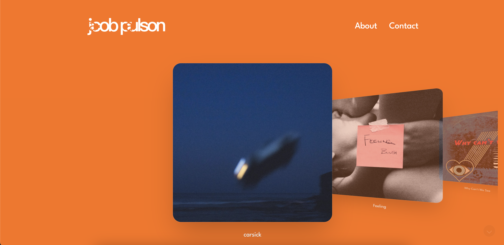
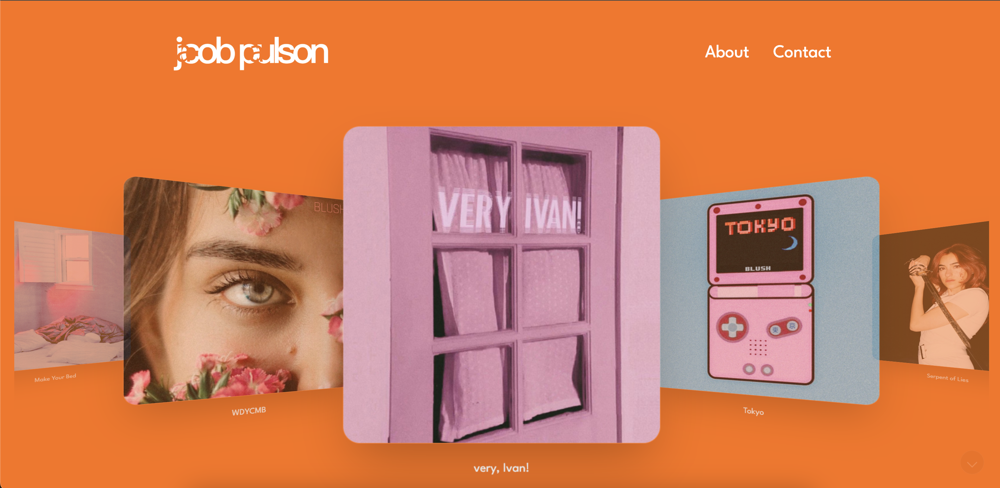
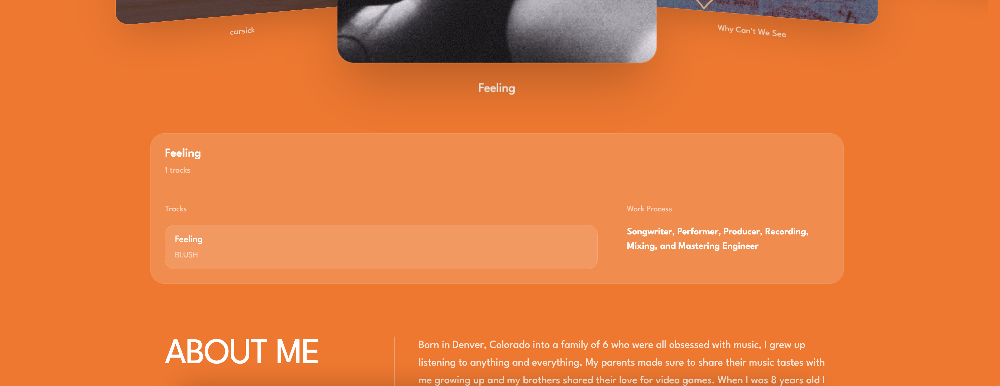

# Jacob Paulson Portfolio

A modern, responsive portfolio website built to showcase music projects created by producer Jacob Paulson. The site uses the Spotify API to let users explore and listen to music directly from a Spotify playlist.

## Live Demo

[View Live Site](https://jacobpaulson.music/)

## Overview

**Jacob Paulson Portfolio** is a Next.js web application designed for a music producer portfolio. The site presents Jacob Paulson’s music work in a polished, interactive, and user-friendly format.

The project focuses on combining clean visual design with music playback functionality through the Spotify API, giving visitors a simple way to discover and listen to the producer’s work.

## Features

- Responsive design for desktop, tablet, and mobile
- Mobile-friendly layout and navigation
- Interactive user experience
- Spotify API integration
- Music playlist display and listening experience
- Contact section
- Portfolio/project showcase
- Smooth animations powered by GSAP
- Clean styling with Tailwind CSS

## Tech Stack

- **Next.js** – React framework for building the web application
- **Tailwind CSS** – Utility-first CSS framework for responsive styling
- **GSAP** – Animation library for smooth frontend interactions
- **Spotify API** – Used to connect playlist/music data and allow users to listen to Jacob Paulson’s music

## Installation

To run this project locally, clone the repository and install dependencies:

```bash
npm install
```

Start the development server:

```bash
npm run dev
```

Then open the project in your browser:

```bash
http://localhost:3000
```

## Project Goals

The goal of this project was to create a professional music portfolio that highlights Jacob Paulson’s production work while making the listening experience simple and interactive for visitors.

The project was built with a focus on:

- Clean visual presentation
- Responsive design
- Easy music discovery
- Spotify-powered playlist functionality
- Smooth animation and interaction
- A polished portfolio experience for a music producer

## Screenshots

### Homepage Section



### Cover Flow Section



### Song Details Section



## What I Learned

While building this project, I practiced creating a polished frontend experience with Next.js, Tailwind CSS, and GSAP while also integrating the Spotify API. This helped strengthen my ability to connect a frontend interface with external API data and build a more interactive user experience.

## Future Improvements

- Add more detailed project or track descriptions
- Improve Spotify playlist controls and UI
- Add loading states for Spotify API data
- Add more animation polish
- Add a CMS or structured data file for easier portfolio updates
- Expand the music showcase with additional playlists or featured tracks

## Author

Built by **Michael Mount**
